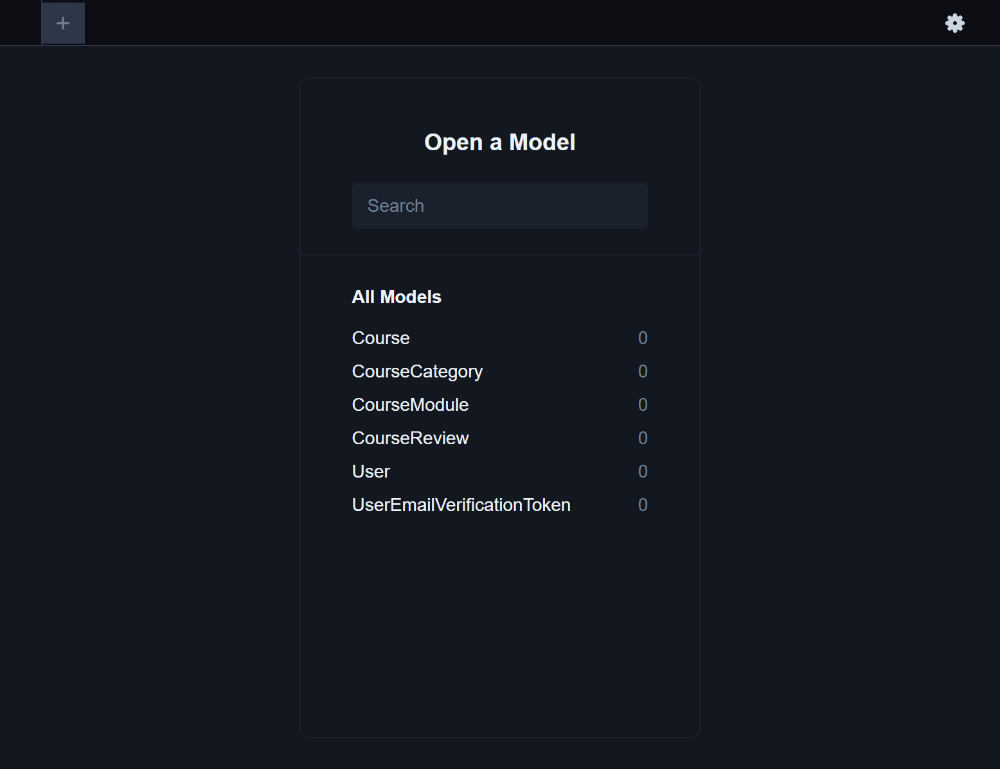

# Stackclique-

A tech Community Project

This is the backend API for the Stackclique mobile application.

---

# Installation and Test of the API

Download the Backend branch of this repo as zip file, extract it into a folder

Create a .env file on the root of your folder and add the following environment variables to the .env file

```env
PORT=500
DATABASE_URL="file:./db.sqlite"
DEV_ENV=true
HASH_SECRET= # any random hash string

MAIL_USER=# your email
MAIL_PASSWORD=# your email password
MAIL_HOST=# your email host
BASE_URL=http://localhost:${PORT}
```

The run the following scripts on your terminal in this order

```cmd
npm run db:sync
npm run start
```

then visit `http://localhost:500/dev/api-docs` to see the `swagger` API documentation.

more endpoints are comming

# Visualise Database

To visualise the data in the database run the command

```cmd
npm run db:seed
npm run db:view
```

- for now i am using sqlite database. But SQL database will be used for the production deployment

You will see a UI like so

